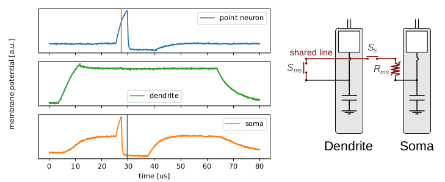
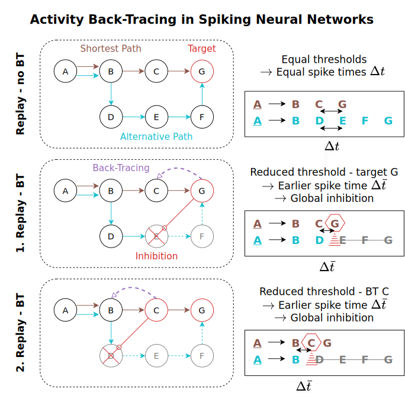

# Neuromorphic Sequential Learning and Replay with Spiking Neural Networks

---
This repository contains code for training a spiking neural network (SNN) on sequential data as well as replaying already learned sequences for e.g. planning purposes. The code is used in multiple papers [[1, 2]](#3-references), and based upon the spiking hierarchical memory (S-HTM) model indroduced by Bouhadjar et al. (2022) [[3]](#3-references). Specific instructions regarding code and configurations specific to these publications can be found in the `docs` folder.

|                                              |                                                     |
|--------------------------------------------------------------------------------------------------------------------------------------------------------------------------------|-----------------------------------------------------------------------------------------------------------------------------------------------------------------------------------|
| [Sequence Learning with Analog Neuromorphic Multi-Compartment Neurons and On-Chip Structural STDP](docs/01_shtm-on-bss2/readme.md) (Dietrich et al. 2024 [[1]](#3-references)) | [Threshold Adaptation in Spiking Networks Enables Shortest Path Finding and Place Disambiguation](docs/02_shtm-backtracing/readme.md) (Dietrich et al. 2025 [[2]](#3-references)) |


## 1 Installation

---
### 1.1 Installation (NEST Simulation)


Please make sure that the 'make' package is installed in your system.

1. Download and prepare repository

```bash
# Preferred   - Clone only specific tag (tag_name), e.g. shtm-on-bss2, and only the state at that revision (saves time and space)
git clone --recurse-submodules --depth 1 --branch <tag_name> git@github.com:dietriro/neuroseq.git
# Alternative - Clone entire repository
git clone --recurse-submodules git@github.com:dietriro/neuroseq.git
# Optional - Checkout desired evaluation data
cd neuroseq/data/evaluation
git checkout <tag_name>
```


2. Install conda

```bash
# Download latest anaconda version
wget https://repo.anaconda.com/archive/Anaconda3-2024.02-1-Linux-x86_64.sh -O conda.sh
# Make script executable
chmod +x conda.sh
# Install anaconda (optionally providing a custom prefix '-p /opt/conda')
./conda.sh -b -p /opt/conda
```


3. Setup conda environment

```bash
# Create a conda environment (with boost-cpp and gxx being optional, only necessary for e.g. a bare ubuntu docker)
conda create --name neuroseq -c conda-forge nest-simulator=3.6.0 boost-cpp gxx_linux-64
# Source new environment
conda activate neuroseq
# Add neuroseq package to Python Path
export PYTHONPATH=/path/to/repository:$PYTHONPATH
# Alternatively, install the package
cd /path/to/repository
pip install .
```

4. Install custom neuron

```bash
# Make sure to source conda environment
conda activate neuroseq
# Make sure that the repository is available on the Python Path
export PYTHONPATH=/path/to/repository:$PYTHONPATH
# Install neuron into current nest installation
python scripts/install_mc_neuron.py
```

5. (Optional) Install custom PyNN-Nest version to remove "initial values" messages.

```bash
# Make sure to source conda environment
conda activate neuroseq
# Download branch fixes
git clone -b fixes git@github.com:dietriro/PyNN.git
# Change directory into new repository
cd PyNN
# Install custom PyNN package
pip install .
```


### 1.2 Installation (BrainScaleS-2)

The BrainScaleS-2 (BSS-2) neuromorphic system can be accessed through the [ebrains](https://www.ebrains.eu/) online platform. Ebrains is openly accessible to anyone, so you can just create an account and freely access hardware resources such as the analog neuromorphic system BrainScaleS-2 [[4]](#3-references) or the digital neuromorphic system SpiNNaker [[5]](#3-references). 
After creating an account on ebrains, you then need to create a new collab workspace on the [wiki](https://wiki.ebrains.eu/bin/view/Collabs?clbaction=create). This collab workspace gives you, among other things, permanent storage space on the ebrains servers. This storage space can then be accessed through the [jupyter lab](https://lab.ebrains.eu/) environment provided by ebrains to store, access, and run code on different kinds of backends.  

After logging into the jupyter lab environment, select the first item ("Official server"), which will launch a server for you to run notebooks on. You can then find the storage for your previously created collab workspace at `shared/<collab-name>`. Here you can clone the _neuroseq_ repository and start running code on BSS-2.

1. Download and prepare repository

```bash
# Preferred   - Clone only specific tag (tag_name), e.g. shtm-on-bss2, and only the state at that revision (saves time and space)
git clone --recurse-submodules --depth 1 --branch <tag_name> git@github.com:dietriro/neuroseq.git
# Alternative - Clone entire repository
git clone --recurse-submodules git@github.com:dietriro/neuroseq.git
# Optional - Checkout desired evaluation data
cd neuroseq/data/evaluation
git checkout <tag_name>
```

2. (Optional) Install missing packages
```bash
# Install bss-2 packages
!pip install -r ./platforms/brainscales-2/requirements.txt
```


## 2 Structure & Usage

---

The _neuroseq_ package contains code for training an S-HTM network on predefined sequences and to replay information after training. The folders containing the required source, config, and documentation files are listed and described in the table below. 

| Folder | Content Description                                                                                |
|-------|----------------------------------------------------------------------------------------------------|
| config | Configuration files for networks, plotting, and environments                                       |
| data  | All the evaluation data, logs, and maps                                                            |
| docs  | Documentation for the individual papers                                                            |
| models | Neuronal models, currently the MC model implemented in NESTML                                      |
| **neuroseq** | Central package containing all code for creating networks, running evaluations, and plotting results |
| plots | Scripts and configuration files for the plots created in the papers                                |
| scripts | Scripts for running and evaluating networks as well as plotting their results                      |
| src   | Additional source data from the BrainScaleS neuromorphic platform                                  |

### 2.1 Overall

The easiest starting point for a first **simulation** or **emulation** run is the `exp_shtm_single.ipynb` file located in the `scripts` folder. It contains all the code necessary for running a singular simulation on CPU or an emulation on hardware. The backend can be defined by the global variable `RuntimeConfig.backend`. Currently, the options are `Backends.NEST` for running a simulation using PyNN-NEST and `Backends.BRAIN_SCALES_2` for running an emulation on BSS-2. In addition to that, the location of the plasticity calculation can be specified by `RuntimeConfig.plasticity_location`. Currently, this is only necessary for the BSS-2 backend. 

Based on these variables, the respective **configuration** will be loaded from the `config` folder during network initialization. Here you can define network parameters, such as the number of neurons or symbols, as well as experimental parameters, such as the random seed offset or the experiment ID. The sequences for the experiment can be either defined in this configuration file or within the `neuroseq_config_environments.yaml` configuration file, in case an environment from the `data/maps` folder is used. In this case, the name of the map has to be defined within the network configuration file under `experiment -> map_name`. 

**Plots** can be replicated by running the `run.py` file in the respective publication folder located within the `plots` folder. The configuration file in the `plots/<publication-folder>/config` folder contains the values used for the publication. Additional adjustments can be made in the `plot_<figure-id>.py` file. 


### 2.2 PyNN-NEST

After successfully installing all the required packages, you should be able to run a simulation using the `scripts/exp_shtm_single.ipynb` notebook with the backend defined as:

```python
# Imports
from neuroseq.common.config import RuntimeConfig, Backends
# Set executing backend to BrainScaleS-2 system
RuntimeConfig.backend = Backends.NEST
```


### 2.3 BrainScaleS-2

To run an emulation on BSS-2, you first have to set the backend as well as the location of the plasticity calculations accordingly:

```python
# Imports
from neuroseq.common.config import RuntimeConfig, Backends, PlasticityLocation
# Set executing backend to BrainScaleS-2 system
RuntimeConfig.backend = Backends.BRAIN_SCALES_2
# Set plasticity location to either 'ON_CHIP' or 'OFF_CHIP'
RuntimeConfig.plasticity_location = PlasticityLocation.OFF_CHIP
```

If the plasticity location is set to `ON_CHIP`, then the entire network including the plasticity will be run on-chip for the simulation duration. There will be no code execution on the host system, except for the performance calculations. With the `OFF_CHIP` location set, the plasticity will be calculated on the host system (server) using the same code as for the PyNN-NEST implementation. 

During the network initialization, the BSS-2 has to run a **calibration** of the analog sensors on-chip. This calibration can take a couple of hours. The result of the successful calibration is written to a local `.calix` folder within the execution directory. If you run the calibration through a notebook in the `scripts` folder, then the calibration will be saved to `scripts/.calix/`. 

The remaining part of running the simulation is analogous to the execution on a host computer using PyNN-NEST. 


## 3 References

---

[1]&nbsp;&nbsp;&nbsp; R. Dietrich, P. Spilger, E. Muller, J. Schemmel, and A. C. Knoll, “[Sequence Learning with Analog Neuromorphic Multi-Compartment Neurons and On-Chip Structural STDP](doi.org/),” in Lecture Notes of Computer Science, Springer Nature, TBP.

[2]&nbsp;&nbsp;&nbsp; R. Dietrich, P. Spilger, E. Müller, J. Schemmel, and A. C. Knoll, Sequence Learning with Analog “[Neuromorphic
Multi-Compartment Neurons and On-Chip Structural STDP]()”, Lecture Notes in Computer Science, TBP Jan. 2025.

[3]&nbsp;&nbsp;&nbsp; Y. Bouhadjar, D. J. Wouters, M. Diesmann, and T. Tetzlaff, “[Sequence learning, prediction, and replay in networks of spiking neurons](doi.org/10.1371/journal.pcbi.1010233),” PLOS Computational Biology, Jun. 2022.

[4]&nbsp;&nbsp;&nbsp; C. Pehle et al., “[The BrainScaleS-2 Accelerated Neuromorphic System With Hybrid Plasticity](doi.org/10.3389/fnins.2022.795876),” Frontiers in Neuroscience, Feb. 2024. 

[5]&nbsp;&nbsp;&nbsp; S. B. Furber, F. Galluppi, S. Temple, and L. A. Plana, “[The SpiNNaker Project](doi.org/10.1109/JPROC.2014.2304638),” Proceedings of the IEEE, May 2014.


